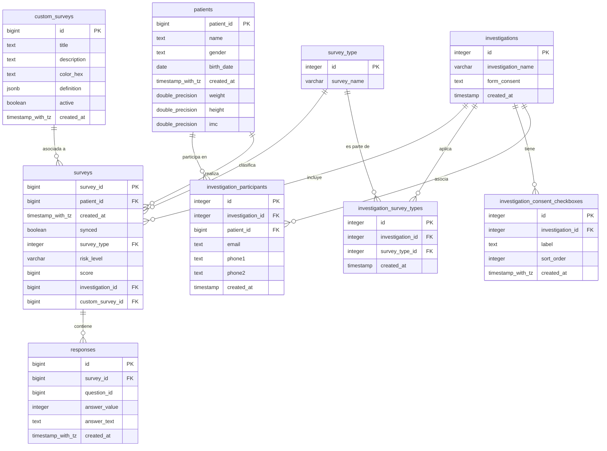

# Documentación de la Base de Datos

Este documento detalla el esquema de la base de datos relacional del sistema, incluyendo tablas, columnas, tipos de datos, nulabilidad y sus relaciones.

---

## Diagrama Entidad-Relación (ERD)

A continuación se presenta el modelo relacional en formato Mermaid:

---

## Detalle de Tablas y Columnas

### 1. `patients`
Almacena la información de los pacientes/participantes evaluados en la aplicación.

| Columna | Tipo de Datos | Nulable | Descripción |
| :--- | :--- | :---: | :--- |
| `patient_id` **(PK)** | `bigint` | NO | Identificador único del paciente (ID incremental). |
| `name` | `text` | NO | Nombre completo del paciente. |
| `gender` | `text` | NO | Género del paciente (ej: 'M', 'F'). |
| `birth_date` | `date` | NO | Fecha de nacimiento (se usa para calcular la edad). |
| `weight` | `double precision` | SÍ | Peso corporal en kg (opcional, usado en Osteoporosis). |
| `height` | `double precision` | SÍ | Estatura en metros (opcional, usado en Osteoporosis). |
| `imc` | `double precision` | SÍ | Índice de Masa Corporal calculado (opcional). |
| `created_at` | `timestamp with time zone` | SÍ | Fecha y hora de creación del registro. |

---

### 2. `surveys`
Almacena el encabezado de las evaluaciones aplicadas.

| Columna | Tipo de Datos | Nulable | Descripción |
| :--- | :--- | :---: | :--- |
| `survey_id` **(PK)** | `bigint` | NO | Identificador único de la encuesta (timestamp en ms + random local). |
| `patient_id` **(FK)** | `bigint` | SÍ | Referencia al paciente evaluado (`patients.patient_id`). |
| `survey_type` **(FK)** | `integer` | SÍ | Tipo de cuestionario aplicado (`survey_type.id`). |
| `investigation_id` **(FK)** | `bigint` | SÍ | Opcional. Vincula la encuesta a un protocolo (`investigations.id`). |
| `custom_survey_id` **(FK)** | `bigint` | SÍ | Opcional. Vincula la encuesta a una definición dinámica (`custom_surveys.id`). |
| `score` | `bigint` | SÍ | Puntuación total obtenida (si aplica). |
| `risk_level` | `character varying` | SÍ | Clasificación cualitativa del resultado (ej: 'high', 'low', 'Moderada'). |
| `synced` | `boolean` | SÍ | Estado de sincronización local (SQLite/Hive) vs servidor (Supabase). |
| `created_at` | `timestamp with time zone` | SÍ | Fecha y hora de aplicación del cuestionario. |

---

### 3. `responses`
Guarda el detalle de las respuestas individuales para cada pregunta de una encuesta.

| Columna | Tipo de Datos | Nulable | Descripción |
| :--- | :--- | :---: | :--- |
| `id` **(PK)** | `bigint` | NO | Identificador único de la respuesta. |
| `survey_id` **(FK)** | `bigint` | NO | Referencia a la encuesta general (`surveys.survey_id`). |
| `question_id` | `bigint` | NO | Identificador numérico de la pregunta o reactivo (`fieldId`). |
| `answer_value` | `integer` | NO | Valor numérico asignado a la respuesta. |
| `answer_text` | `text` | SÍ | Texto opcional en caso de campos abiertos o especificaciones. |
| `created_at` | `timestamp with time zone` | SÍ | Fecha y hora del registro de la respuesta. |

---

### 4. `investigations`
Define los proyectos de investigación o protocolos de estudio clínico disponibles.

| Columna | Tipo de Datos | Nulable | Descripción |
| :--- | :--- | :---: | :--- |
| `id` **(PK)** | `integer` | NO | Identificador único de la investigación. |
| `investigation_name` | `character varying` | NO | Nombre descriptivo del protocolo de estudio. |
| `form_consent` | `text` | SÍ | Texto legal para el Formulario de Consentimiento Informado. |
| `created_at` | `timestamp without time zone` | SÍ | Fecha de registro de la investigación. |

---

### 5. `investigation_participants`
Tabla de unión que vincula pacientes con las investigaciones en las que participan, agregando datos de contacto.

| Columna | Tipo de Datos | Nulable | Descripción |
| :--- | :--- | :---: | :--- |
| `id` **(PK)** | `integer` | NO | Identificador único de la participación. |
| `investigation_id` **(FK)** | `integer` | NO | Referencia a la investigación (`investigations.id`). |
| `patient_id` **(FK)** | `bigint` | NO | Referencia al paciente (`patients.patient_id`). |
| `email` | `text` | SÍ | Correo electrónico de contacto del participante. |
| `phone1` | `text` | SÍ | Teléfono principal de contacto. |
| `phone2` | `text` | SÍ | Teléfono secundario alternativo. |
| `created_at` | `timestamp without time zone` | NO | Fecha y hora de vinculación al estudio. |

---

### 6. `investigation_consent_checkboxes`
Configuración dinámica de casillas de verificación requeridas para otorgar consentimiento en una investigación específica.

| Columna | Tipo de Datos | Nulable | Descripción |
| :--- | :--- | :---: | :--- |
| `id` **(PK)** | `integer` | NO | Identificador único de la casilla de consentimiento. |
| `investigation_id` **(FK)** | `integer` | NO | Referencia a la investigación vinculada (`investigations.id`). |
| `label` | `text` | NO | Enunciado de aceptación que se mostrará en pantalla (ej: "Acepto participar..."). |
| `sort_order` | `integer` | NO | Orden visual en la interfaz. |
| `created_at` | `timestamp with time zone` | SÍ | Fecha de creación del registro. |

---

### 7. `investigation_survey_types`
Define qué tipos de encuestas componen y son requeridas para completar una investigación.

| Columna | Tipo de Datos | Nulable | Descripción |
| :--- | :--- | :---: | :--- |
| `id` **(PK)** | `integer` | NO | Identificador único de la regla. |
| `investigation_id` **(FK)** | `integer` | NO | Referencia a la investigación (`investigations.id`). |
| `survey_type_id` **(FK)** | `integer` | NO | Referencia al tipo de encuesta (`survey_type.id`). |
| `created_at` | `timestamp without time zone` | NO | Fecha de registro de la asociación. |

---

### 8. `survey_type`
Catálogo estático de tipos de encuestas predeterminadas en el sistema (ej: BDI-II, BAI, SF-36, etc.).

| Columna | Tipo de Datos | Nulable | Descripción |
| :--- | :--- | :---: | :--- |
| `id` **(PK)** | `integer` | NO | Identificador único del tipo de encuesta (ej: 1=BDI-II, 2=BAI, 15=SocialDeterminants). |
| `survey_name` | `character varying` | NO | Nombre del cuestionario / instrumento estándar. |

---

### 9. `custom_surveys`
Definiciones de encuestas personalizadas creadas dinámicamente por los investigadores.

| Columna | Tipo de Datos | Nulable | Descripción |
| :--- | :--- | :---: | :--- |
| `id` **(PK)** | `bigint` | NO | Identificador de la encuesta personalizada. |
| `title` | `text` | NO | Título visible del cuestionario. |
| `description` | `text` | SÍ | Descripción o instrucciones del cuestionario. |
| `color_hex` | `text` | SÍ | Código hexadecimal de color para estilizar la encuesta en la app (ej. '#FF5733'). |
| `definition` | `jsonb` | NO | Estructura JSON dinámica que define las preguntas, opciones y campos del formulario. |
| `active` | `boolean` | NO | Estado del cuestionario (activo/inactivo). |
| `created_at` | `timestamp with time zone` | NO | Fecha y hora de creación de la encuesta dinámica. |
